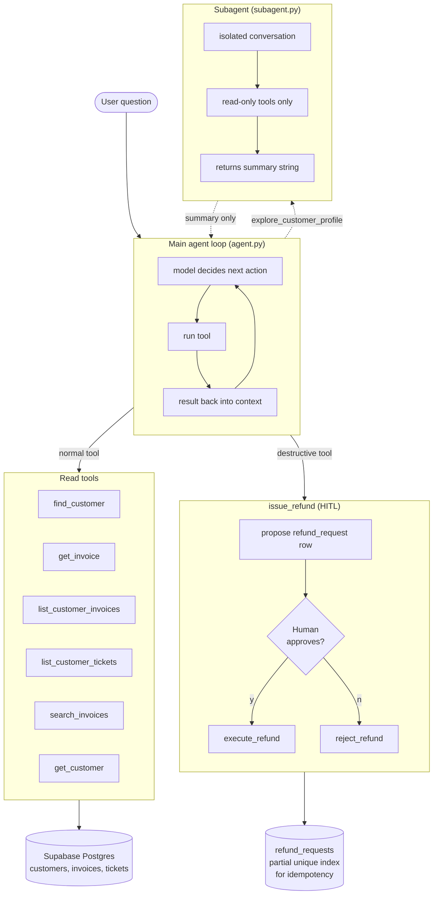

# Project 2 — Enterprise Ops Agent

A tool-using agent over a mock CRM/ERP schema — customers, invoices, support tickets, refunds — built against a Supabase Postgres database. I built it twice: once as a hand-rolled loop against Groq, and once on the Claude Agent SDK, so I could compare the abstraction against the thing it abstracts. The agent can issue refunds, which gates on human approval before anything is written. There is also an isolated research subagent for deep-dive customer questions, and a 21-task evaluation harness that runs the whole thing end to end.

The human-in-the-loop gate is enforced in code rather than in the prompt. The function that actually writes a refund to the database is not in the tool list the model sees, so there is nothing for the model to call even if it decides it wants to. Prompt-level "please get human approval" instructions are not relied on and are not sufficient.

## Architecture



## What's in the repo

- `src/agent.py` — hand-rolled loop. Groq (openai/gpt-oss-120b). Max steps, HITL gate, errors returned to the model as tool results rather than raised.
- `src/agent_sdk.py` — the same agent rebuilt on `claude-agent-sdk` with a `PreToolUse` hook for approval.
- `src/subagent.py` — isolated read-only exploration loop. Returns a summary string; token stats come back on a module-level side channel so the main agent never sees them.
- `src/tools.py` — 7 tools over Supabase Postgres.
- `evals/golden_tasks.jsonl` — 21 hand-written tasks across 5 categories.
- `evals/run_evals.py` — runner with deterministic string-based scoring. During eval runs the HITL gate auto-rejects by patching `input()`.

## Numbers

### Subagent experiment

Same question — "full situation report on GrubMatch Foods" — run once with the main agent calling tools directly, and once where the main agent only had `explore_customer_profile` and had to delegate.

|                       | No subagent | Subagent  |
|-----------------------|------------:|----------:|
| Main input tokens     |       9,359 |     1,122 |
| Main output tokens    |       1,640 |       556 |
| Main steps            |           5 |         2 |
| Subagent input tokens |           0 |     8,302 |
| Total input           |       9,359 |     9,424 |

The main-conversation tokens drop from 9.3K to 1.1K, but the total cost is almost the same because the subagent did the same work in its own conversation. The point of the pattern isn't cost per question — it's that the main agent's context stays small as the conversation continues. The cost is answer quality: the subagent's summary dropped some invoice dates that the direct version kept.

### Evals — 21 tasks, five categories

| Category     | Passed |
|--------------|-------:|
| easy_lookup  | 4/4    |
| multi_step   | 6/6    |
| reasoning    | 6/6    |
| refund_flow  | 1/2    |
| unanswerable | 3/3    |
| Overall      | 20/21  |

Averages per task: 2.7 steps, 5,108 main input tokens, 181 output tokens.

The one remaining failure (`refund_01`) is a scoring problem, not an agent problem — the agent said "approve" where the test expected "approval". I kept it as a failure rather than add the synonym, because expanding the keyword list to pass is just gaming the metric.

The first time I ran the harness it scored 15/20. When I read the five failures, four of them were tests I had written too strictly and one was a real agent issue (see Known limitations). I rewrote the four tests, added one more reasoning task, and reran at 20/21. The lesson I took from this: a bad eval number isn't automatically a bad system. You have to read the failures before you believe the headline.

## Design decisions

**HITL gate in code, not prompt.** The `issue_refund` tool creates a proposal row and returns the proposal ID. The actual execute and reject functions are helpers inside the loop, not entries in `TOOL_REGISTRY`, so the model literally cannot ask for them. The user is shown the proposal and types y or n before the loop calls execute or reject.

**Errors go back to the model as tool results.** When a tool raises, the exception is caught and the error string becomes the content of a `tool` message. The model sees it on the next turn and can try something different. Letting the exception propagate would kill the loop and the user would see a stack trace.

**Idempotency at the database layer.** `refund_requests` has `UNIQUE (invoice_id, amount) WHERE status IN ('proposed','approved')`. A retry of the same proposal returns the existing refund ID instead of creating a duplicate row. Rejected proposals are deliberately non-sticky — a rejected refund can be re-proposed later with a different amount.

**SDK HITL uses a `PreToolUse` hook, not `can_use_tool`.** My first version used the SDK's `can_use_tool` callback to approve or deny refund calls. The tool ran anyway and the proposal row showed up in the database — the SDK auto-approves allow-listed tools before the callback runs, and it emits a `CanUseToolShadowedWarning` but doesn't raise. The HITL gate was silently bypassed. I caught it by checking the database, not by reading the warning. Switched to a `PreToolUse` hook via `HookMatcher`, which fires deterministically.

**Subagent token stats via side channel.** `explore_customer_profile` returns only `{"summary": "..."}` to the main agent. The subagent's step count and token totals are appended to a module-level list that the main loop reads after the call. If the model could see the token counts, they'd just become more tokens in its context, which is the opposite of what the subagent is for.

## Known limitations

The one real failure in the eval harness, `reason_01`, was not a reasoning failure. The question "which customers currently have overdue invoices" needs around 19 `get_customer` calls to resolve names, which blew the context to 29K tokens and hit MAX_STEPS at step 10. The tool shape doesn't match the question shape. Three ways to fix it: join customer names into `search_invoices`, raise MAX_STEPS, or delegate name resolution to the subagent. I didn't patch it because the finding itself is the useful thing — it's the kind of architectural failure that doesn't show up until you measure.

Substring-based scoring misses synonyms, which is why `refund_01` still fails. A larger eval set would need an LLM judge calibrated against human labels. For 21 tasks that I can audit by eye, deterministic string checks are enough.

The refund tests check the final text, not whether `issue_refund` was actually called. A proper trace-level eval would assert the tool-call sequence happened before scoring the answer. Known gap.

One model handles everything. A real system would route easy lookups and refusals to a cheaper model like Haiku to cut cost.

No tenant isolation anywhere. That's Project 3.

## Running it

See `pyproject.toml` for dependencies. Needs `GROQ_API_KEY` and `SUPABASE_DB_URL_P2` in `.env`. For `agent_sdk.py`, also `ANTHROPIC_API_KEY`.

Hand-rolled agent on one question:

```bash
cd src && uv run agent.py
```

Full eval sweep:

```bash
uv run evals/run_evals.py
```